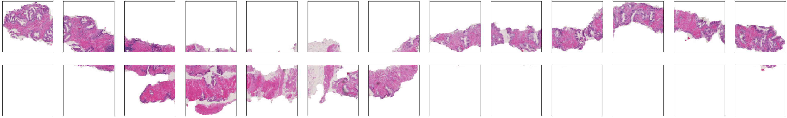
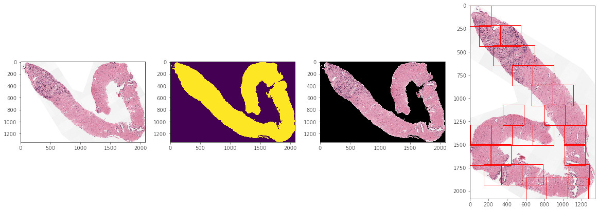
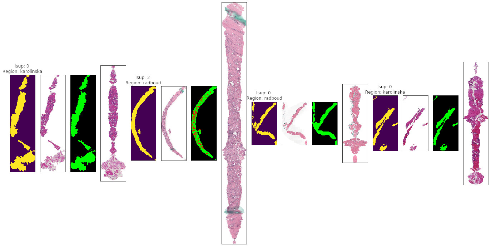

# Prostate Cancer Detection from Whole Slide Images

Prostate cancer detection from whole slide images using Pytorch and Pytorch-lightning.

## Contents

- [Prostate Cancer Detection from Whole Slide Images](#prostate-cancer-detection-from-whole-slide-images)
  - [Contents](#contents)
  - [Problem](#problem)
  - [Data Processing](#data-processing)
  - [Training](#training)
    - [Model](#model)
    - [Loss](#loss)
    - [Augmentations](#augmentations)
  - [Results](#results)
  - [Winning Strategies](#winning-strategies)
  - [Reproducing](#reproducing)


## Problem

The aim of the [Prostate Cancer Grade Assessment Challenge](https://www.kaggle.com/c/prostate-cancer-grade-assessment) was to predict the ISUP grade level of prostate cancer present in whole slide images. The quadratic kappa metric was used to for evaluation in the competition so as to optimise for inter-rater agreement on the test-set labels. Detecting prostate cancer from whole slide images poses several challenges:

1. The images are extremely large but contain a small proportion of tissue per slide, making choosing relevant parts of the image important.
2. The data is fairly difficult to collect and so there are not too many examples (10616 in this competition, where around 2000 are different levels of the same images). Additionally, it suffers from significant variation in staining technique and equipment on a per-lab basis.
3. There is significant label noise as oncologists often can't agree. Additionally, this training set was labelled by students while the test set was labelled by a cohort of experts. Pen marks were also present in the training set but not in the test set.

## Data Processing

Processing the data is extremely important to select regions of the slide that are important to the classification while ignoring all of the background. I used 2 methods of selecting patches from the WSI's. The first method was a naive grid based method, generating a grid around the image and selecting patches based on the sum of the pixel values. This would select the darker patches of the cells while ignoring the white background. See `src/data_gen/naive_patch/naive_crop.py`.



The second method was more complicated in trying to select better patches from the WSI by applying a filter, thresholding, and then selecting the number of patches to take at successive y-coordinates along the image. Furthermore, this allows more control over the selection of patches: I could allow overlap or gaps between patches, choose how much a patch should be filled before it is included and offset the starting point of the patches so that the dataset could be augmented by patches that are translated across the slide. I also spent a lot of time improving the basic masking here by separating parts of the biopsy that were split by whitespace but in the same image, rotating these separate parts of the biopsy into a better position to avoid the background and filling gaps in the mask. See `src/data_gen/betterconvcrop/betterconvcrop.py`.



Additionally, I tried a recursive tree based patching method which would recursively split the image into small patches, however, this didn't help. One more method which was interesting was a 'padding and alignment' method where I aligned all of the pixel rows in the images so to get a uniform image size for training the network. While the output was interesting, it didn't improve training and resulted in much slower training.



## Training

I trained my models using pytorch and pytorch-lightning, 42 patches of size 224. I also used half precision, gradient clipping and a OneCycle scheduler. I also tried model distillation on additional datasets from TCGA and PESO but this did not improve the results. See `src/train.py` for the pytorch lightning training script and `src/distill.py` for the distillation.

### Model

I used an Efficient-Net B0 model for most of my experiments (resnets and resnexts performed worse and took longer to train). I tried 2 variations on the same idea. First, I joined the patches up into a square image that was processed through the network with a basic regression objective. This worked well on the validation set but did not perform equally on the leaderboard.

The second variation passed each patch into the network individually, and the pooling them together in the head of the network. This method worked slightly worse in validation but performed better on the leaderboard. This conundrum led me to believe that the test set was quite different from the training (and validation) set, and thus led to the huge shake-up of the leaderboard at the end of the competition.

### Loss

I tried a few different losses: basic classification (CE), regression with MSE, MAE, and huber, and ordinal regression, as well as combining some together. Ordinal regression performed best on the validation and leaderboard in most of my experiments.

### Augmentations

I tried quite a few augmentation methods, even running a small grid search over different augmentations. For the most part the only augmentations that worked well where flips, translation, scale, and rotation. I tried changing gamma, brightness and contrast, hue, saturation and value, and adding gaussian noise and cutout. Most of the time these additions performed worse on the validation set. After a lot of tweaking of the values in these augmentations though, they kept the validation score the same and so I kept them for the final submissions. See `src/dataset.py` for the augmentations in the dataset.

Additionally, I apply the transformations at different scales: at the patch level and at the global level to all the patches. At the local patch level, I applied:

```python
albu.ShiftScaleRotate(shift_limit=0.1, scale_limit=0.1, rotate_limit=90, p=0.7, border_mode=cv2.BORDER_CONSTANT, value=(255,255,255)),
albu.HorizontalFlip(p=0.5),
albu.VerticalFlip(p=0.5),
albu.Transpose(),
albu.GaussNoise(p=0.2),
albu.CoarseDropout(6, 20, 20, 2, p=0.3, fill_value=255),
```

At the global scale, I applied the following augmentations to all of the patches with the same value in the hope that the output image distribution should be the same across patches:

```python
albu.RandomGamma((90, 110), p=0.25),
albu.RandomContrast(p=0.25, limit=0.1),
albu.RandomBrightness(p=0.25, limit=0.1),
albu.HueSaturationValue(hue_shift_limit=0, sat_shift_limit=15, val_shift_limit=5, p=0.25),
```

Additionally, I tried using cycle GAN to translate images between domains (karolinska and radboud lab) but this did not seem to work.

## Results

For the final submission, I ensembled 3 models with different patch sizes (160 and 224) and a dual loss (huber and ordinal). I used translation in the patch generation, TTA (horizontal and vertical flips and transpose), averaging together the predictions from all the models. I additionally submitted a model based on the naive generation as well, since this performed better on the leaderboard than the better patch generation.

| Model | Local Validation | Public LB | Private LB |
| ---   | ---              | ---       | ---        |
| Improved crop ensemble | Individually 0.87 | 0.88451 | 0.91042 |
| Naive crop model       | 0.89              | 0.89202 | 0.90514 |

The shake-up for this competition was particularly large - I was in the top 100 on the public LB but ended up at 485/1010 teams on the private LB. While the leaderboard result is not particularly good, I learnt a lot in this competition and the result of 0.91 qk is still very good on such a task (the winning score was 0.94qk).

## Winning Strategies

Here I sum up some of the winning strategies from the top teams. The shake up from public to private was extreme in most cases. I also look at those solutions where the shake up was small (the results on the public and private leaderboard are similar.)

1. [PND](https://www.kaggle.com/c/prostate-cancer-grade-assessment/discussion/169143)
   - Emphasized label denoising by pseudolabeling the validation set and removing training images that had very different predictions from the labels. If the absolute difference between the label was >1.6 the image was removed.
   - Averaging ensemble of EffNet-B0 and B1 trained on denoised images.
   - Naive (grid) tile generation. 64 256 px patches.
2. [Save The Prostate](https://www.kaggle.com/c/prostate-cancer-grade-assessment/discussion/169108)
   - Squeeze excite layer before pooling in a resnet34.
   - 2 network heads: classification and regression.
   - Initially 49 patches followed by 89 patches fine-tuning. Naive (grid) sampling. 192 - 224px depending on model.
   - Only rotate and vertical flip augmentations at the tile level and shift, scale, rotate, flip and rotate at slide level.
   - 0.3* oof prediction + 0.7* groundtruth as new label.
   - Ensemble of 4 different models trained slightly differently by teammates.
3. [Mikhail Druzhinin](https://www.kaggle.com/c/prostate-cancer-grade-assessment/discussion/169232)
   - Simple naive (grid) tile concatenation with Effnet baseline: 0.880 public, 0.934 private
4. [NS Pathology](https://www.kaggle.com/c/prostate-cancer-grade-assessment/discussion/169113)
   - 5 model ensemble (resnest, effnet, seresnext)
   - 16 patches of 512px, naive (grid) sampled.
   - Online noise removel using [O2UNet](https://openaccess.thecvf.com/content_ICCV_2019/papers/Huang_O2U-Net_A_Simple_Noisy_Label_Detection_Approach_for_Deep_Neural_ICCV_2019_paper.pdf). Removes high loss from each batch.
5. [Kiminya](https://www.kaggle.com/c/prostate-cancer-grade-assessment/discussion/169213)
   - Semi supervised resnext5032x4d on patches of 192, 256 and 384px. [Improved tiling](https://www.kaggle.com/akensert/panda-optimized-tiling-tf-data-dataset) which is similar to my own improved patch generation method above.
   - Affine transforms, ordinal loss.
6. [BarelyBears](https://www.kaggle.com/c/prostate-cancer-grade-assessment/discussion/169230)
   - Denoising by [online uncertainty sample mining](https://arxiv.org/abs/1901.07759) (OUSM) and mixup. OUSM removes losses that are much larger than the others in the batch. See [noise_loss.py](https://github.com/analokmaus/kaggle-panda-challenge-public/blob/master/models/noisy_loss.py#L97)


Small shake-up:
- See 2 and 4.
11. [Iafoss](https://www.kaggle.com/c/prostate-cancer-grade-assessment/discussion/169205)
    - 128 patches at 128px
    - 8 model voting ensemble of resnext50
    - Excluded ~1400 Radboud and 300 Karolinska uncertain samples to denoise data using oof predictions. Similar to winning solution.
    - Noted that better tile selection like 5 above would have increased private LB to 0.94 as well.
    - [Kappa loss](https://arxiv.org/pdf/1509.07107v2.pdf)


## Reproducing

First generate patches using scripts in `src/data_gen`.

Train:

```
git clone https://github.com/NVIDIA/apex && cd apex && pip install -v --no-cache-dir --global-option="--cpp_ext" --global-option="--cuda_ext" ./
pip install pytorch_lightning==0.7.6 efficientnet_pytorch timm kaggle albumentations
python train.py /path/to/patches --stack --npatches 42 --imsize 224
```
